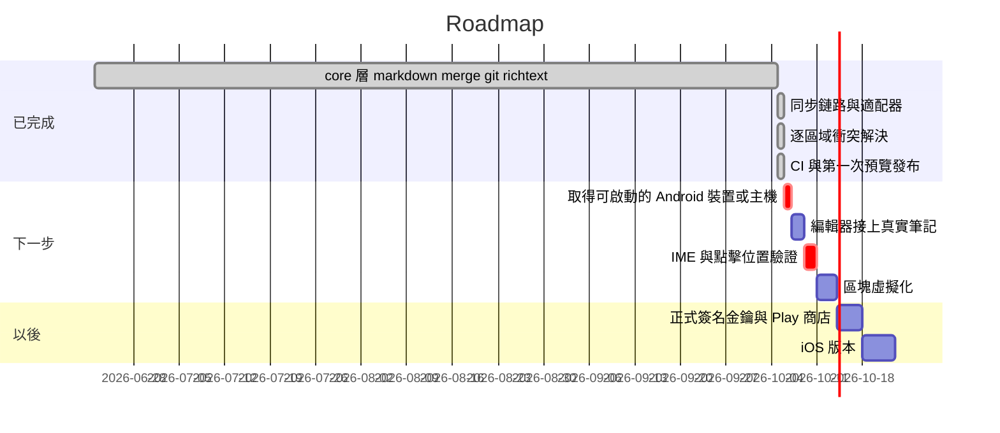

# Roadmap

---
slug: roadmap
title: Roadmap
role: milestones
updated: "2026-10-05T16:05:00"
---

## Milestones

## 現在卡在哪裡

**唯一真正阻塞的是真機驗證。** 開發主機沒有 `/dev/kvm`，emulator 起不來，
所以下列每一項都還沒有被任何自動化或人工驗證過：

- 編輯器兩層對齊（debug 模式就是為了等人去開著看）
- 中文輸入法組字期間的錯位
- git 適配器對真實 expo-file-system 的行為（邏輯全測過，expo 那側未驗證）
- 已發布的 APK 在真機上能不能裝、能不能跑

見 [[android-first-target]] 與 [[android-release-signing]]。
