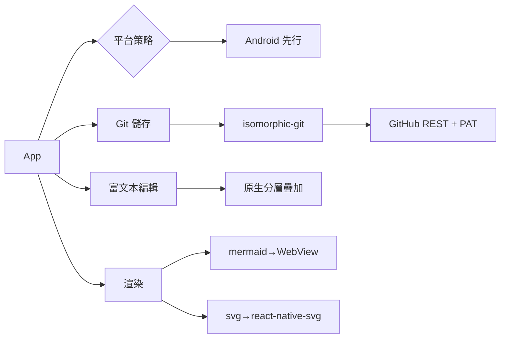

# Tech stack

---
slug: stack
title: Tech stack
role: tech-stack choices
---

## Technology choices

| domain | candidates | decision | rationale |
|---|---|---|---|
| app framework | bare RN / Expo / web-first | **Expo SDK 57 + prebuild (CNG)** | 唯一能在本機實際 build 出 APK 驗證的路線；原生模組由 `expo install` 對齊版本，不手寫 android/ 目錄 |
| git engine | 原生 libgit2 / 裝置 git 二進位 / 純 JS | **isomorphic-git** | RN 沒有 git；純 JS 可跨平台且能在 Node 直接測試。見 [[github-pat-git-transport]] |
| git transport | git 智慧協定 / SSH / REST | **GitHub REST API + PAT** | 沙盒限制少、憑證單純。transport 可注入以便測試與未來換 Gitea/GitLab |
| credentials | 明文 / Keychain / OS keystore | **expo-secure-store** | token 絕不進 repo、不進 commit、不進 log。見 [[github-pat-git-transport]] |
| local files | RNFS / expo-file-system | **expo-file-system** | isomorphic-git 需要真實路徑與 stream 讀寫，Expo 的 FS 模組已足夠 |
| rich text editor | WebView+ProseMirror / 原生分層疊加 | **原生分層疊加**（`<Text>` 底層 + 透明 `TextInput` 上層） | 使用者指定原生。Android 的 TextInput 不吃 styled children，故需疊加。見 [[native-richtext-editor]] |
| markdown | 套件 / 自寫 | **自寫 core 解析器 + 序列化器** | 編輯器與渲染器共用同一份 AST；雙向轉換需自訂行為，套件反而要繞過 |
| mermaid | 純 JS 版 / WebView | **WebView 沙盒（mermaid.js）** | mermaid 需要 DOM，行動端無替代方案。唯讀渲染，不影響「編輯不用 WebView」 |
| svg | react-native-svg / 轉點陣 / WebView | **react-native-svg + 自寫 svg→rnsvg 轉換** | 真正的向量渲染，非點陣降級 |
| images | RN Image / 轉 base64 | **RN Image + 相對路徑** | 圖片隨 repo 走，遠端渲染走 git blob URL |

## 核心架構原則
`core/` 是**純 TypeScript**：不 import React、React Native、expo 或 isomorphic-git 的 IO 層。這讓 markdown、diff3 合併、文件模型、編輯操作都能用 `node --test` 在無模擬環境下測試，也是 [[android-first-target]] 得以成立的前提。

## Decision mindmap

## Open items
- Expo 57 對 RN 版本的確切搭配需實際 `npx expo install` 驗證後回填。
- 中文輸入法（IME）組字期間（composing）會不會造成透明 TextInput 與底層錯位，需在 Android 實機測試。
