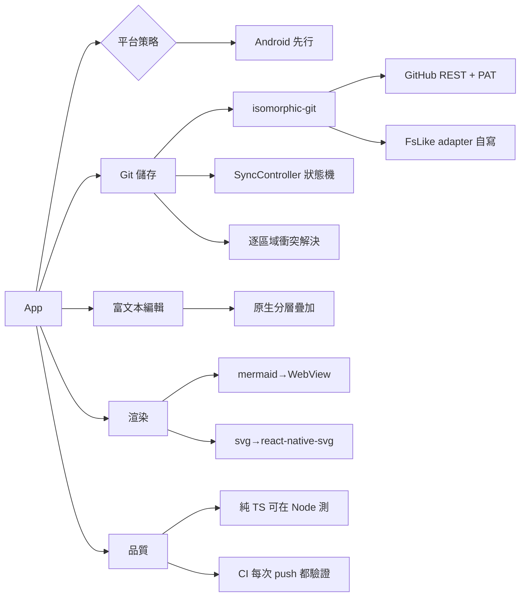

# Tech stack

---
slug: stack
title: Tech stack
role: tech-stack choices
updated: "2026-10-05T15:10:00"
---

# Tech stack

## Technology choices

| domain | candidates | decision | rationale |
|---|---|---|---|
| app framework | bare RN / Expo / web-first | **Expo SDK 57 + prebuild (CNG)** | 唯一能在本機實際 build 出 APK 驗證的路線；原生模組由 `expo install` 對齊版本，不手寫 android/ 目錄 |
| git engine | 原生 libgit2 / 裝置 git 二進位 / 純 JS | **isomorphic-git** | RN 沒有 git；純 JS 可跨平台且能在 Node 直接測試。見 [[github-pat-git-transport]] |
| git transport | git 智慧協定 / SSH / REST | **GitHub REST API + PAT** | 沙盒限制少、憑證單純。transport 可注入以便測試與未來換 Gitea/GitLab |
| credentials | 明文 / Keychain / OS keystore | **expo-secure-store** | token 絕不進 repo、不進 commit、不進 log。遠端網址/作者/分支存普通 JSON，不放 keystore——見 [[sync-chain-wiring]] |
| local files | RNFS / expo-file-system | **expo-file-system + 自寫 FsLike adapter** | isomorphic-git 需要真實路徑與 stream 讀寫。adapter 的真實契約是實測出來的，見 [[git-fs-adapter-contract]] |
| rich text editor | WebView+ProseMirror / 原生分層疊加 | **每個區塊一個 `TextInput`**，區塊樣式在輸入框外 | Android 的 `TextInput` 不吃 styled children，疊加方案無法對齊。見 [[native-richtext-editor]] |
| markdown | 套件 / 自寫 | **自寫 core 解析器 + 序列化器** | 編輯器與渲染器共用同一份 AST；雙向轉換需自訂行為，套件反而要繞過 |
| mermaid | 純 JS 版 / WebView | **WebView 沙盒（mermaid.js）** | mermaid 需要 DOM，行動端無替代方案。唯讀渲染，不影響「編輯不用 WebView」 |
| svg | react-native-svg / 轉點陣 / WebView | **react-native-svg + 自寫 svg→rnsvg 轉換** | 真正的向量渲染，非點陣降級 |
| images | RN Image / 轉 base64 | **RN Image + 相對路徑** | 圖片隨 repo 走，遠端渲染走 git blob URL |
| CI | 無 / 只有 Pages / 完整驗證 | **GitHub Actions：install → typecheck → test → differential → bundle** | 邏輯幾乎全是純 TS，測試在 Node 直接跑；bundle 是沒有裝置時最接近「app 建得起來」的代理 |

## 核心架構原則
`core/` 是**純 TypeScript**：不 import React、React Native、expo 或 isomorphic-git 的 IO 層。這讓 markdown、diff3 合併、文件模型、編輯操作都能用 `node --test` 在無模擬環境下測試，也是 [[android-first-target]] 得以成立的前提。

`core/` 也承擔**可從裝置剝離的適配器邏輯**：路徑轉換、stat 形狀、錯誤碼。adapter 本身離開裝置無法驗證，能抽出來的部分就抽出來測。

**平台邊界不得 cast。** expo 型別的 `as unknown as` 會讓 typecheck 失效——實測藏過一個會讓 sync 完全不能用的 bug。見 [[expo-boundary-no-casts]]。

## Decision mindmap

## Open items
- **本機無 `/dev/kvm`，emulator 無法啟動。** 編輯器的實機對齊、git adapter 對真實 expo-file-system 的行為，都沒有任何自動化驗證；CI 的 bundle 步驟只涵蓋 module graph。
- 編輯器還沒接上真實筆記（`EditorScreen` 仍用寫死的範例文字），所以衝突處理裡的「手動編輯」目前會跳到一個編輯錯誤內容的畫面。
- 大筆記需要區塊虛擬化；每個區塊一個 `TextInput` 的元件數量成本尚未處理。
- 中文輸入法（IME）組字期間（composing）會不會造成透明 TextInput 與底層錯位，需在 Android 實機測試。
- 若要讓 CI 跑 emulator，需要一台有 KVM 的 runner；可行時再加一個 device job，而不是把 on-device 斷言塞進純 Node 測試。
